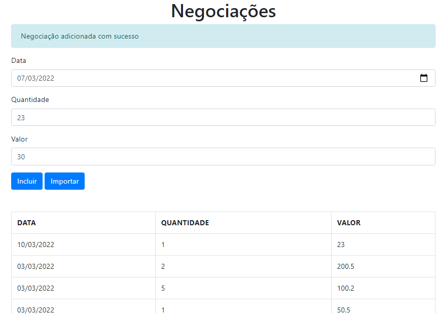

#   Typescript parte 3: Mais técnicas e boas práticas

Conhecendo as vantagens do uso de Decorators

Criando diferentes tipos de decorators e deixe seu código ainda mais elegante

Compreendendo os benefícios do uso de interfaces

Aprendendo a organizar e a adicionar tipo em seu código ao consumir uma API REST

Entendendo o papel de sourceMaps e aprenda como debugar a sua aplicação no navegador

Criando soluções combinando tudo o que aprendeu nos módulos anteriores

Benefício do Polimorfismo garantindo um código protegido e dinâmico

# ScreenShot

## FORMULÁRIO DE CADASTTRO DA NEGOCIAÇÃO

### 01.Entendendo Decorators
- Introdução e estrutura do projeto
- Requisitos não funcionais
- Decorator de método
- Logar tempo de execução com decorator

### 02.Decorators de métodos
- Decorator com parâmetro
- Criação de um decorator de inspeção
- Ordem de execução dos decorators
- Simplicação no design de decorators
- Portabilidade de funcionalidade antiga para decorators

### 03.Decorator de propriedades
- Como evitar código duplicado
- Decorator de propriedade
- Criação dinâmica de getters
- O uso de Object.defineProperty
- Cache de decorators

### 04.API externa e interface
- API externa
- Consumindo API externa
- Definindo uma interface para a API
- Isolando o acesso à API em um serviço

### 05.Mais sobre interface
- Chega de múltiplos console.log
- Aplicação prática do Polimorfismo
- Interface de método
- Evitando importar negociações duplicadas
- Estendendo interfaces
- Geração de sourmaps e debug da aplicação no navegador

 # CONCLUÍDO

 
<h1 align="center">💻 Desenvolvido Por: Gilberto Júnior</h1>
